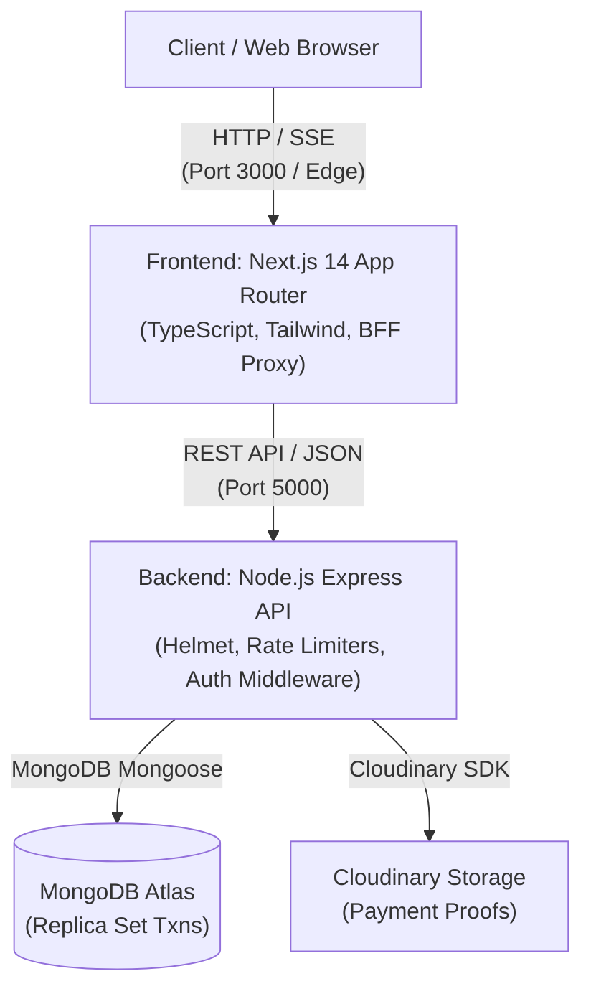

# Zephyr PR Tracker - System Architecture & Refactoring Baseline

This document provides a comprehensive technical overview of the **Zephyr PR Tracker** codebase, detailing system components, entry points, data flows, security design, high-risk modules, and available commands to establish a baseline for safe incremental refactoring.

---

## 1. System Overview & Architecture

Zephyr PR Tracker is a multi-tenant event participation, referral attribution, and payment verification system built for student clubs and organizations.



---

## 2. Directory Structure & Key Entry Points

```
zephyr-pr-tracker/
├── package.json                   # Root Developer Scripts & Workspace Management
├── Procfile                       # Production deployment process spec (backend)
├── render.yaml                    # Infrastructure-as-code specification for Render
├── README.md                      # General user setup documentation
├── ARCHITECTURE.md                # Technical system design & refactoring baseline (This File)
├── backend/                       # Express Node.js REST API
│   ├── package.json               # Backend dependencies & npm scripts
│   ├── server.js                  # Main Express application entry point
│   ├── config/
│   │   └── cloudinary.js          # Cloudinary SDK image upload & deletion helper
│   ├── middleware/
│   │   └── security.js            # Helmet header security & express-rate-limit specs
│   ├── models/                    # Mongoose Data Schemas & Models
│   │   ├── Club.js                # Multi-tenant organization accounts
│   │   ├── Event.js               # Club event listings & capacities
│   │   ├── PRMember.js            # Club PR team members with referral codes & hashed PINs
│   │   ├── Registration.js        # Event registrations & verification states
│   │   └── Counter.js             # Atomic sequential ID generator (REG-0001)
│   ├── routes/                    # API Route Handlers
│   │   ├── auth.js                # Authentication helpers
│   │   ├── clubs.js               # Club registration, login, and platform management
│   │   ├── events.js              # Event management endpoints
│   │   ├── members.js             # PR member management & member login
│   │   └── registrations.js       # Registration submission, queues, approvals & SSE
│   ├── scripts/                   # Utility Scripts & Tests
│   │   ├── seed.js                # Database seeder script
│   │   ├── migrate-to-clubs.js    # Data migration script for multi-tenancy
│   │   └── test-transaction-logic.js # Concurrency & transaction retry unit tests
│   └── utils/
│       ├── auth.js                # JWT session signing & PIN verification
│       ├── errors.js              # Custom AppError & HTTP error classes
│       ├── statusEmitter.js       # Server-Sent Events (SSE) manager
│       └── transaction.js         # Mongoose transaction retry wrapper with backoff
└── frontend/                      # Next.js 14 App Router Frontend
    ├── package.json               # Frontend dependencies & Next.js scripts
    ├── next.config.js             # Next.js configuration
    ├── tsconfig.json              # TypeScript compiler configuration
    ├── tailwind.config.ts         # Tailwind CSS styling design system
    ├── proxy.ts                   # Next.js API BFF proxy helper
    ├── app/                       # App Router Pages & API Route Proxies
    │   ├── page.tsx               # Public home page / club directory
    │   ├── clubs/page.tsx         # Active clubs directory
    │   ├── register/              # Participant registration forms
    │   │   ├── page.tsx           # Default club selector / registration page
    │   │   └── [clubSlug]/        # Dynamic club-specific registration route
    │   ├── status/[id]/page.tsx   # Real-time participant status tracking (SSE)
    │   ├── my-status/page.tsx     # Tracking ID lookup page
    │   ├── pr/                    # PR Member Portal
    │   │   ├── page.tsx           # PR member login
    │   │   └── dashboard/         # PR referral queue & analytics
    │   ├── admin/                 # Club Admin Portal
    │   │   ├── page.tsx           # Club admin queue & overview
    │   │   └── audit/page.tsx     # Review audit logs
    │   ├── platform/clubs/page.tsx# Platform super-admin club approvals
    │   ├── login/page.tsx         # Club admin login
    │   ├── signup/page.tsx        # Club registration request
    │   └── api/                   # BFF proxy route handlers forwarding to Express
    └── components/                # Reusable React components (Header, Queue, Icons)
```

---

## 3. Core Data Flow & Key Workflows

### 3.1 Participant Registration & Payment Proof Upload

1. Student accesses `/register/[clubSlug]`.
2. Student submits details, payment amount, UTR/ref number, and UPI screenshot file.
3. Next.js API route proxies request to backend `POST /api/registrations`.
4. Backend uploads screenshot to Cloudinary (`zephyr-payments` folder) and saves `Registration` document with status `"pending"`.
5. If a valid referral code was supplied, registration is tagged with `referralCode`.

### 3.2 Verification & Sequential ID Assignment

1. PR Member logs into `/pr/dashboard` (authenticated via code + PIN).
2. PR Member calls `POST /api/registrations/:id/approve`.
3. Backend executes approval inside a MongoDB session transaction (`withTransaction`):
   - Atomically increments `Counter` sequence.
   - Generates sequential registration number (e.g. `REG-0001`).
   - Updates `Registration` status to `"approved"`, sets `regNo` and `reviewedBy`.
4. `statusEmitter` broadcasts status change to client via SSE at `/status/[id]`.

### 3.3 Rejection & Asset Cleanup

1. Reviewer calls `POST /api/registrations/:id/reject` with a `rejectionReason`.
2. Registration status updates to `"rejected"`.
3. Background task cleans up Cloudinary payment screenshot using `paymentScreenshotPublicId`.

---

## 4. High-Risk Modules & Refactoring Safeguards

The following modules require extra caution during future refactoring:

| Module / Component                                   | Risk Level      | Primary Risk                                                                                                  | Safeguard / Strategy                                                                                        |
| ---------------------------------------------------- | --------------- | ------------------------------------------------------------------------------------------------------------- | ----------------------------------------------------------------------------------------------------------- |
| `backend/utils/transaction.js` & `models/Counter.js` | 🔴 **CRITICAL** | Race conditions during concurrent registration approvals leading to duplicate `regNo` or failed transactions. | Must preserve `withTransaction` exponential backoff retry loop and MongoDB ClientSession parameter passing. |
| `backend/config/cloudinary.js` & Rejection handlers  | 🟡 **HIGH**     | Orphaned image accumulation in Cloudinary storage if deletion calls fail silently on rejection.               | Ensure error logging and fallback cleanup routines are maintained when changing registration schemas.       |
| `frontend/proxy.ts` & `frontend/app/api/...`         | 🟡 **HIGH**     | Authentication session token drop or double-proxy header stripping during Next.js API routing.                | Verify HTTP-only cookie headers and bearer token forwarding on all API route updates.                       |
| `backend/middleware/security.js` (`trust proxy`)     | 🟡 **MEDIUM**   | Misconfigured client IP rate-limiting when deployed behind reverse proxies (Render / Vercel).                 | Maintain `app.set("trust proxy", 1)` in Express server setup.                                               |

---

## 5. Development & Operations Command Registry

All standard commands required to build, run, test, and manage the project are recorded below.

### 5.1 Root Quick Commands (Recommended)

| Task                          | Command                        |
| ----------------------------- | ------------------------------ |
| Install dependencies (all)    | `npm run install:all`          |
| Run backend unit tests        | `npm run check:backend`        |
| Run frontend type checking    | `npm run check:frontend:types` |
| Run frontend production build | `npm run check:frontend:build` |
| Run full system check (all)   | `npm run check:all`            |
| Start backend dev server      | `npm run dev:backend`          |
| Start frontend dev server     | `npm run dev:frontend`         |

### 5.2 Standalone Backend Commands (`cd backend`)

| Task                       | Command           |
| -------------------------- | ----------------- |
| Install dependencies       | `npm install`     |
| Start dev server (Nodemon) | `npm run dev`     |
| Start production server    | `npm start`       |
| Run transaction unit tests | `npm test`        |
| Seed database              | `npm run seed`    |
| Run multi-tenant migration | `npm run migrate` |

### 5.3 Standalone Frontend Commands (`cd frontend`)

| Task                         | Command              |
| ---------------------------- | -------------------- |
| Install dependencies         | `npm install`        |
| Start dev server             | `npm run dev`        |
| Run TypeScript type check    | `npm run type-check` |
| Build production application | `npm run build`      |
| Start production server      | `npm start`          |

---

## 6. Environment Secret & Security Audit

- **Environment File Tracking**: `.env` and `.env.local` files are strictly excluded via `.gitignore` and are not committed into git.
- **Example Templates**: `.env.example`, `.env.local.example`, and `.env.production.example` are committed with safe placeholder defaults.
- **Committed Code Inspection**: No hardcoded API keys, database passwords, or JWT secrets were found committed in git tracked files.
