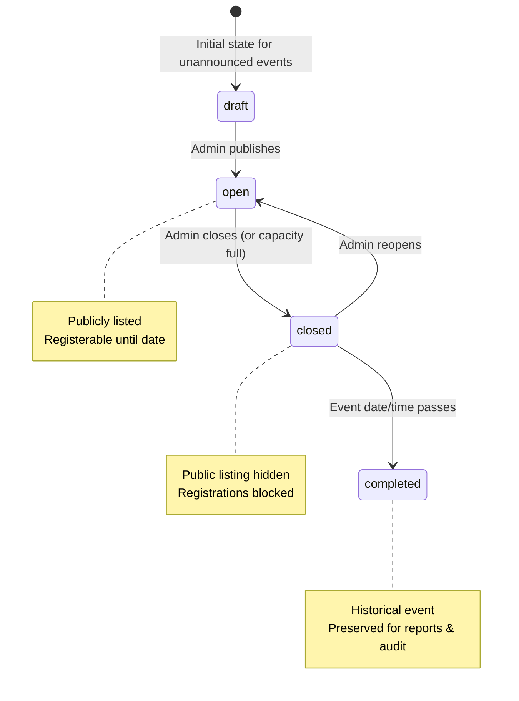

# Event Lifecycle Guide

## Overview

This document specifies the operational rules, event lifecycle semantics,and expiration enforcement procedures for the Zephyr PR Tracker platform.

---

## 1. Event Lifecycle Semantics

Events in Zephyr transition through four explicit lifecycle states:



| Lifecycle State |  Public Catalog Listing   |   Registration Ingestion   | Description                                                                            |
| :-------------- | :-----------------------: | :------------------------: | :------------------------------------------------------------------------------------- |
| **`draft`**     |         Excluded          | Blocked (`EVENT_NOT_OPEN`) | Internal event in preparation by club administrators.                                  |
| **`open`**      | Visible (if future-dated) |          Allowed           | Published active event accepting participant registrations until its date/time passes. |
| **`closed`**    |         Excluded          |  Blocked (`EVENT_CLOSED`)  | Registration window explicitly closed by administrators.                               |
| **`completed`** |         Excluded          | Blocked (`EVENT_EXPIRED`)  | Event date has elapsed or festival concluded. Preserved for historical reporting.      |

---

## 2. How Expiration is Calculated

An event is registerable **only** when all of the following conditions hold true:

1. `status === "open"`
2. `date` is a valid date object or ISO timestamp.
3. `new Date(event.date).getTime() > Date.now()` (the scheduled time is in the future).

**Missing or Undated Events**:

- Undated events (`date: null` or missing) are treated as expired/non-registerable by default to prevent indefinite unverified registrations.
- Server-side validation rejects registration attempts on expired/completed events with HTTP `422 Unprocessable Entity` and stable code `EVENT_EXPIRED`.

---

## 3. Manual Event Corrections & Reopening

Club administrators can manage and correct event states via the authenticated API:

### Reopening a Closed Event:

```http
POST /api/events/:id/reopen
Authorization: Bearer <club_session_token>
```

_Sets `status: "open"`. Note: The event must have a future date to become registerable._

### Explicitly Closing an Event:

```http
POST /api/events/:id/close
Authorization: Bearer <club_session_token>
```

_Sets `status: "closed"`._

### Marking an Event Completed:

```http
POST /api/events/:id/complete
Authorization: Bearer <club_session_token>
```

_Sets `status: "completed"`._

### Updating Date or Details:

```http
PUT /api/events/:id
Authorization: Bearer <club_session_token>
Content-Type: application/json

{
  "date": "2026-11-20T10:00:00.000Z",
  "status": "open"
}
```

---
